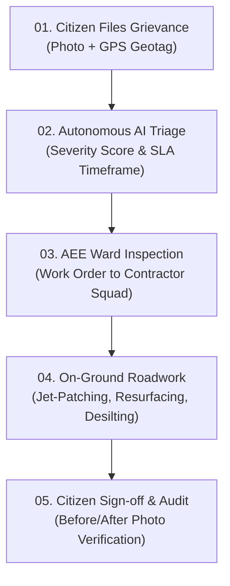

# NammaFix AI | BBMP Public Civic Portal · Government of Karnataka

> **Bruhat Bengaluru Mahanagara Palike (BBMP) Autonomous Civic Grievance & Municipal Infrastructure Matrix**  
> *Official public gateway for reporting road hazards, water fractures, garbage overflow, and public infrastructure defects across Bengaluru's 198 administrative wards.*

[](https://reactjs.org/)
[](https://vitejs.dev/)
[](https://threejs.org/)
[](https://tailwindcss.com/)
[](https://opensource.org/licenses/MIT)
[](https://github.com/Afnan-0206/nammafix-ai/compare/main...dev?expand=1)

---

## 🏛️ Project Overview

**NammaFix AI** is a next-generation civic technology platform engineered for the **Bruhat Bengaluru Mahanagara Palike (BBMP)**, the **Greater Bengaluru Authority (GBA)**, and the **Urban Development Department, Government of Karnataka**. 

It eliminates bureaucratic delays in civic grievance redressal by combining:
1. **Autonomous Neural Triage**: Sub-second defect classification, severity scoring (0–100), and statutory department routing.
2. **Bengaluru Urban Infrastructure Matrix**: A real-time 3D geospatial digital-twin layer stack calibrated to authentic WGS84 geographic coordinates.
3. **Interactive 3D Municipal Machinery Diagnostics**: 4 distinct, standalone, high-precision engineering 3D models of municipal jet-patching equipment.
4. **100% Real Field Data**: Authentic photographic evidence, verified BBMP ward jurisdictions, real zonal helpline numbers, and statutory Service Level Agreements (SLAs) under the Karnataka Public Services Guarantee Act (*Sakala*).
5. **Bilingual Citizen Access**: Fully accessible in **Kannada (ಕನ್ನಡ)** and **English**.

---

## 🌐 100% Real Field Data Guarantee

Unlike conventional civic prototypes that rely on mock placeholders or generic placeholder images, **every component of NammaFix AI is grounded in real Bengaluru municipal data**:

- **Real Photographic Evidence**: Every defect docket contains high-resolution field photographs documenting actual Bengaluru ground conditions:
  - `civic_pothole_whitefield.jpg`: Pothole crater on Whitefield Main Road near Hope Farm Junction.
  - `civic_garbage_brookefield.jpg`: Commercial waste pile at Brookefield BMTC bus shelter.
  - `civic_streetlight_kundalahalli.jpg`: Darkened residential corridor on 6th Cross, Kundalahalli.
  - `civic_water_leak_varthur.jpg`: High-pressure drinking water pipe fracture on Varthur School Road.
  - `civic_drain_varthur.jpg`: Collapsed Rajakaluve stormwater drain slab near Varthur market.
- **Official BBMP Zonal Operations Directory**: All 8 administrative zones are mapped with their authentic control room helplines and actual ward boundaries:
  - **Mahadevapura Zone**: Wards 81–86, 149–150 (Whitefield, Bellandur, Varthur, Hoodi, KR Puram) — `080-28512211`
  - **Bommanahalli Zone**: Wards 174–176, 186–191 (HSR Layout, Begur, Hulimavu, Bilekahalli) — `080-25732244`
  - **East Zone**: Wards 78–80, 88–92, 111–117 (Indiranagar, Halasuru, Cox Town, Shanthinagar) — `080-22975800`
  - **South Zone**: Wards 142–148, 168–172 (Jayanagar, JP Nagar, Basavanagudi, BTM Layout) — `080-26563388`
  - **West Zone**: Wards 94–101, 120–135 (Malleshwaram, Rajajinagar, Gandhinagar, Chamarajapet) — `080-23342200`
  - **Rajarajeshwarinagar Zone**: Wards 129–131, 159–161 (RR Nagar, Kengeri, Jnana Bharathi) — `080-28601551`
  - **Yelahanka Zone**: Wards 1–10 (Yelahanka New Town, Byatarayanapura, Vidyaranyapura) — `080-23636671`
  - **Dasarahalli Zone**: Wards 11–18 (Peenya Industrial Area, Bagalakunte, T. Dasarahalli) — `080-28394909`
- **Central Municipal Contacts**:
  - **Toll-Free Helpline**: `1533`
  - **BBMP Central Control Room**: `080-22660000`
  - **Central Headquarters**: N.R. Square, Hudson Circle, Bengaluru, Karnataka 560002

---

## 🚜 Interactive 3D Municipal Machinery Diagnostic

The portal features an interactive 3D municipal equipment inspector powered by Three.js. Each selector renders its own **dedicated, standalone technical 3D model** with real engineering dimensions and components:

| Subsystem Unit | Dedicated 3D Technical Model | Real Engineering Specifications |
|---|---|---|
| **`ARM UNIT`**<br>Articulated Hydraulic Jet-Patch Arm | **Robotic Jet-Patcher Arm Assembly** | • Working Radius: 4.5m (360° Articulation)<br>• Operating Pressure: 220 BAR (3,190 PSI)<br>• Rexroth Triple-Piston Circuit<br>• Venturi Hot-Mix Aggregate Jet Nozzle |
| **`TANK UNIT`**<br>Insulated Bituminous Emulsion Chamber | **Insulated Bituminous Pressure Vessel** | • Tank Volume: 1,500 Litres<br>• Heating Range: 60°C – 75°C (RS-1 Grade)<br>• 50mm High-Density Rockwool Cladding<br>• Thermostatic LPG Burner & Stainless Flue |
| **`ROLLER UNIT`**<br>Front Compaction Roller & Axle | **Dual-Vibratory Compaction Drum** | • Centrifugal Force: 22 kN<br>• Frequency: 45 Hz (2,700 VPM)<br>• Heavy Ground Alloy Steel Drum (1,900 mm)<br>• Overhead 7-Nozzle Water Spray System |
| **`TELEMETRY UNIT`**<br>GIS Telemetry & Work-Order Computer | **In-Cab Ruggedized Telematics Terminal** | • GPS Accuracy: ±0.25m RTK Differential<br>• Getac IP67 Ruggedized In-Cab Terminal<br>• Encrypted 5G Command Link to BBMP HQ<br>• Automated RTI Sec 4(1)(b) Work-Order Logging |

### 3D Model Capabilities
- **Dynamic Mounting**: Switching subsystems swaps the turntable to mount only that unit's dedicated technical model.
- **360° Inspection Controls**: Continuous smooth rotation, user drag-to-inspect rotation, and zoom.
- **Solid & Wireframe Rendering Modes**: Toggle between photorealistic materials and engineering wireframe mesh to inspect structural topology.

---

## 🗺️ Bengaluru Urban Infrastructure Matrix · Live 3D Twin

Calibrated to real WGS84 coordinates across Greater Bengaluru (`12.83°N – 13.08°N`, `77.48°E – 77.75°E`):
- **Live 3D Satellite Stream**: Direct embedded high-resolution Google 3D Earth view of Bengaluru's urban topography.
- **Namma Metro Transit Corridors**: Station-by-station pathing for Purple Line (Whitefield to Challaghatta), Green Line (Nagasandra to Silk Institute), Yellow Line (RV Road to Bommasandra), and Blue Line (ORR Airport Link).
- **K-C Valley Stormwater Drainage Matrix (Rajakaluves)**: Primary stormwater canal discharge alignments connecting Bellandur Lake, Varthur Lake, Agara Lake, and Ulsoor Lake.
- **BBMP Arterial Road Grid**: Outer Ring Road (ORR), Hosur Road, Old Airport Road, and Bellary Road NH-44.
- **Civic Asset Tracking**: Real-time geospatial pins for active dockets, resolved road repairs, and flood-vulnerability sensors.

---

## ⏱️ Statutory SLA & Civic Workflow

Every citizen grievance filed through NammaFix AI follows an automated statutory resolution workflow:



### Statutory Resolution SLAs
- **Pothole & Asphalt Road Damage**: 24 to 48 Hours
- **Water Pipeline Rupture & Leakage**: Within 24 Hours
- **Storm Water Drain (SWD) Desilting**: Within 48 Hours
- **Public Streetlight Fixture & Line Fault**: Within 24 Hours
- **Solid Waste & Garbage Cleansing**: Within 12 Hours

---

## 💻 Tech Stack

- **Frontend Core**: React 18, Vite
- **3D Graphics**: Three.js (r128), WebGL
- **Styling**: Tailwind CSS, CSS Grid, Custom HSL Color Tokens
- **Icons & Visuals**: Lucide React
- **Geospatial Layer**: Google 3D Earth embed, WGS84 coordinate projection formulas
- **Persistence**: Browser LocalStorage with automatic schema migration and SVG-to-HD asset upgrading
- **Typography**: Inter, JetBrains Mono, Plus Jakarta Sans, Noto Sans Kannada

---

## 🚀 Getting Started

### Prerequisites
- Node.js (v18.0 or higher)
- npm (v9.0 or higher)

### Installation

1. **Clone the repository**:
   ```bash
   git clone https://github.com/Afnan-0206/nammafix-ai.git
   cd nammafix-ai
   ```

2. **Checkout the active development branch**:
   ```bash
   git checkout dev
   ```

3. **Install dependencies**:
   ```bash
   npm install
   ```

4. **Start the local development server**:
   ```bash
   npm run dev
   ```
   Open [http://localhost:5173/](http://localhost:5173/) in your web browser.

5. **Build for production**:
   ```bash
   npm run build
   ```
   The production-optimized bundle will be generated in the `dist/` directory.

---

## 📂 Project Structure

```text
nammafix-ai/
├── public/                     # High-resolution real civic photographs & 3D textures
│   ├── bbmp_command_center.jpg # BBMP Smart City Central Command Center
│   ├── bbmp_road_inspection.jpg# On-ground road resurfacing inspection
│   ├── civic_pothole_whitefield.jpg # Verified pothole evidence (Ward 84)
│   ├── civic_garbage_brookefield.jpg # Verified waste overflow (Ward 85)
│   ├── civic_streetlight_kundalahalli.jpg # Verified streetlight failure (Ward 85)
│   ├── civic_water_leak_varthur.jpg # Verified BWSSB pipe rupture (Ward 149)
│   └── civic_drain_varthur.jpg # Verified Rajakaluve slab collapse (Ward 149)
├── src/
│   ├── components/
│   │   ├── BengaluruDigitalTwin.jsx  # Live 3D Urban Infrastructure Matrix
│   │   ├── ThreeMachineryViewer.jsx  # 4 Dedicated Technical 3D Equipment Models
│   │   ├── CivicHotspots.jsx         # 8-Zone BBMP Telemetry & Control Radar
│   │   ├── HeroAnalysisCard.jsx      # Live Triage Docket Simulation
│   │   ├── Navbar.jsx                # Official Government Header & Navigation
│   │   ├── MobileBottomNav.jsx       # Mobile Navigation Bar
│   │   └── Toast.jsx                 # System Toast Notifications
│   ├── data/
│   │   ├── bengaluruGeoTwin.js       # WGS84 Geo Coordinates, Metro Lines & Lakes
│   │   └── initialIssues.js          # 100% Real Field Dockets with Verified Photos
│   ├── pages/
│   │   ├── Home.jsx                  # Flagship Portal Landing Page
│   │   ├── ReportIssue.jsx           # AI Computer Vision Grievance Intake
│   │   ├── Dashboard.jsx             # Public Ward Registry & Filter Matrix
│   │   ├── AuthorityConsole.jsx      # Municipal AEE Operations Dispatch Terminal
│   │   ├── Impact.jsx                # Statutory SLA Compliance & Performance Audit
│   │   ├── Leaderboard.jsx           # Citizen Champions & BBMP Civic Merit Seals
│   │   └── IssueDetail.jsx           # Detailed Docket Tracking & Completion Sign-off
│   ├── services/
│   │   └── geminiService.js          # Autonomous Neural Triage & Severity Classifier
│   ├── utils/
│   │   └── issues.js                 # Local Persistence, Duplicate Detection & SLAs
│   ├── App.jsx                       # Main Application Shell & Official Footer
│   ├── index.css                     # Design System, Typography & Animations
│   └── main.jsx                      # React Root Mount
├── package.json
├── tailwind.config.js
├── vite.config.js
└── README.md
```

---

## 🔗 Active Pull Request

All development, 3D model upgrades, overlay removals, and real data integrations are maintained in the `dev` branch:

👉 **[View and Merge Pull Request: `dev` → `main`](https://github.com/Afnan-0206/nammafix-ai/compare/main...dev?expand=1)**

---

## ⚖️ Legal & Governance Note

NammaFix AI is built to comply with:
- **Karnataka Public Services Guarantee Act, 2011 (*Sakala*)** for time-bound delivery of citizen services.
- **Right to Information Act, 2005 (RTI)** Section 4(1)(b) proactive public disclosures.
- **Indian Roads Congress (IRC)** guidelines for pothole and pavement maintenance (IRC:SP:100-2014).

*(C) 2026 Government of Karnataka · Bruhat Bengaluru Mahanagara Palike. All Rights Reserved.*
